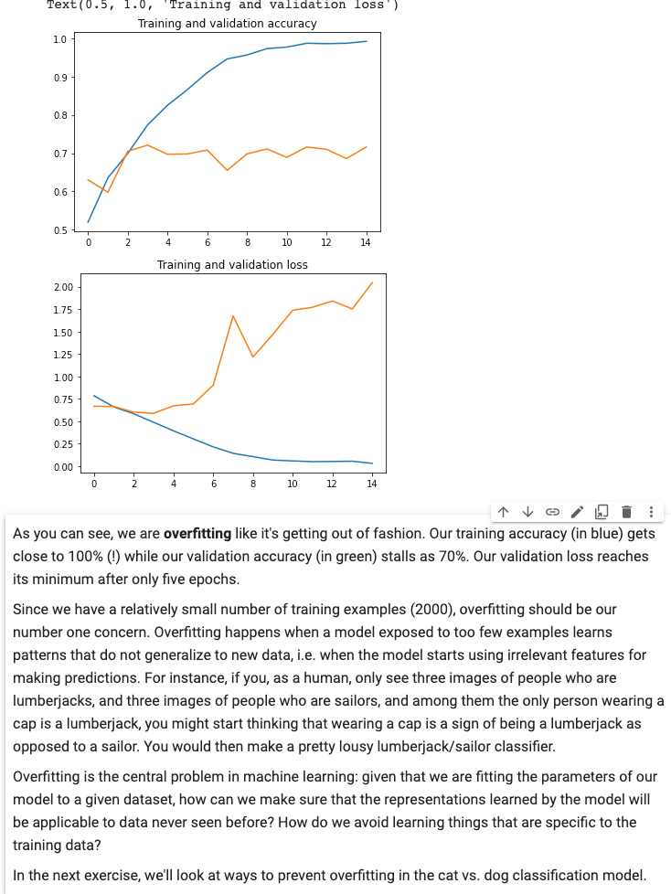

[source](https://www.coursera.org/learn/convolutional-neural-networks-tensorflow#syllabus)
# WHAT YOU WILL LEARN

Handle real-world image data

Plot loss and accuracy

Explore strategies to prevent overfitting, including augmentation and dropout

Learn transfer learning and how learned features can be extracted from models

Week1 Exploring a Larger Dataset 
-------

* high level APIs you could do basic image classification
* filter the dataset, data cleaning. 
*  go deeper into using ConvNets will real-world data, and learn about techniques that you can use to improve your ConvNet performance, particularly when doing image classification!

[the famous Kaggle Dogs v Cats dataset](https://www.kaggle.com/c/dogs-vs-cats)

[Initial model](https://colab.research.google.com/github/lmoroney/dlaicourse/blob/master/Course%202%20-%20Part%202%20-%20Lesson%202%20-%20Notebook.ipynb#scrollTo=_qqNIbspb_NV)
 
From this notebook: (same as course_2_part_2_lesson_2_notebook )
1. In this case, using the [RMSprop](https://wikipedia.org/wiki/Stochastic_gradient_descent#RMSProp) optimization algorithm is preferable to stochastic gradient descent (SGD), because RMSprop automates learning-rate tuning for us. (Other optimizers, such as Adam and Adagrad, also automatically adapt the learning rate during training, and would work equally well here.)
2. Find the overfitting by plotting: 

