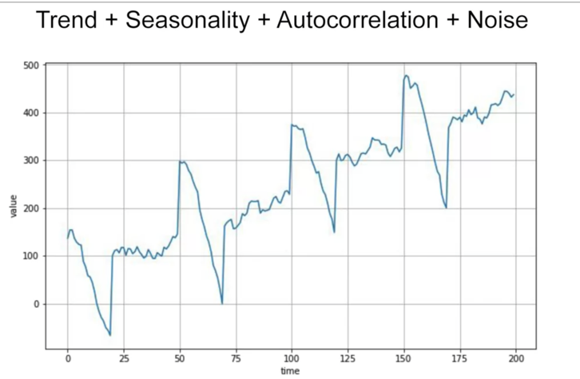

# Note: 

---
Week1 Sequences and Prediction
---

*  anything that has a time factor in it can be analyzed in this way
    * birth rate 
    * imputation (project back into the past)
    * detect anomalies. For example, in website logs so that you could see potential denial of service attacks showing up as a spike on the time series like this.
    
*  analyze the time series to spot patterns in them that determine what generated the series itself
    * speech recognition

## common patterns:

* trends
* seasonality (shopping, sport)
* white noise
*  auto correlated time series. Namely it correlates with a delayed copy of itself often called a lag
    * 
    
* real-life time series
    * 
    * 
    * 
    * 
    

* Train Validation and test sets
    * 

* Metrics for evaluating performance
    * 

* Moving average and differencing
    * 
    * Moving average on Differenced Time Series
    * 
    * 
    * Smoothing Both Past and Present Values
    * 

## Sequence bias

Sequence bias is when the order of things can impact the selection of things. For example, if I were to ask you your favorite TV show, and listed "Game of Thrones", "Killing Eve", "Travellers" and "Doctor Who" in that order, you're probably more likely to select 'Game of Thrones' as you are familiar with it, and it's the first thing you see. Even if it is equal to the other TV shows. So, when training data in a dataset, we don't want the sequence to impact the training in a similar way, so it's good to shuffle them up.

## More info on Huber loss
Please find the Wikipedia page here.